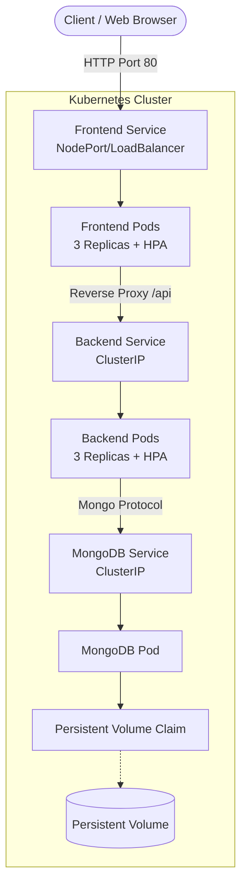

# Containerization-and-Deployment-using-Docker-Kubernetes
# DevOps To-Do List Application

## Project Overview

This project is a containerized 3-tier web application (Frontend: HTML/JS, Backend: Python/Flask, Database: MongoDB) demonstrating best practices in Docker and Kubernetes deployments for a DevOps portfolio.

It features:
- **Frontend Tier**: Lightweight Nginx container serving static HTML/JS communicating with the backend.
- **Backend Tier**: Python/Flask API serving To-Do items, utilizing Gunicorn for production-ready performance.
- **Database Tier**: Persistent MongoDB instance holding the application data.
- **Microservices Orchestration**: Fully configured `docker-compose.yml` for local development.
- **Kubernetes Scaling**: Complete K8s manifests including Deployments, Services (LoadBalancer/ClusterIP), Persistent Volumes (PV/PVC), and Horizontal Pod Autoscalers (HPA).

## Architecture Diagram



## Step-by-Step Deployment Instructions

### Option 1: Local Deployment with Docker Compose

1. **Start the application suite:**
   ```bash
   docker-compose up -d --build
   ```
2. **Access the application:**
   Open http://localhost in your web browser.
3. **Stop everything:**
   ```bash
   docker-compose down
   ```

### Option 2: Kubernetes Deployment

1. **Build the container images (if not using pre-built/registry):**
   ```bash
   cd backend
   docker build -t devops-todo-backend:latest .
   cd ../frontend
   docker build -t devops-todo-frontend:latest .
   cd ..
   ```

2. **Apply Database Resources (PV, PVC, Deployment, Service):**
   ```bash
   kubectl apply -f k8s-manifests/mongo-pv-pvc.yaml
   kubectl apply -f k8s-manifests/mongo-deployment-svc.yaml
   ```

3. **Apply Backend Resources (Deployment, Service, HPA):**
   ```bash
   kubectl apply -f k8s-manifests/backend-deployment-svc.yaml
   kubectl apply -f k8s-manifests/backend-hpa.yaml
   ```

4. **Apply Frontend Resources (Deployment, Service, HPA):**
   ```bash
   kubectl apply -f k8s-manifests/frontend-deployment-svc.yaml
   kubectl apply -f k8s-manifests/frontend-hpa.yaml
   ```

5. **Verify the Deployment:**
   - Check Pod status: `kubectl get pods`
   - Check Services: `kubectl get svc`
   - Check Autoscalers: `kubectl get hpa`

6. **Access the Application:**
   If using Minikube or similar local clusters, you can access the frontend NodePort service via:
   ```bash
   minikube service frontend
   ```
   Or access the Node IP directly on port `30080`.
